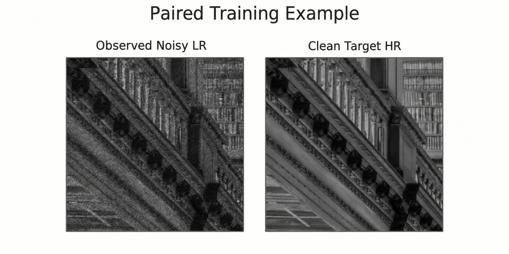
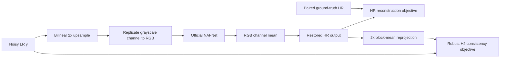

# Physically Motivated Compound-Degradation Image Restoration

> [2nd Place Overall, Team TAUIG](https://drive.google.com/file/d/1J8r_s9TB1i0g8wlXXWLe6oYmtwyoM9_I/view?usp=sharing), KLA AI Hackathon, IIT Hyderabad 2026.
> [Public leaderboard](https://drive.google.com/file/d/1ljUQov6SCQWBecOtH92l9pNomgWWjmEg/view?usp=sharing): rank 13 (0.88614). [Private leaderboard](https://drive.google.com/file/d/1yg0PYCcsbPbGYoGU24Yfj9zb5nMNqvGM/view?usp=sharing): rank 10 (0.88303). [Final presentation rank](https://www.linkedin.com/feed/update/urn:li:activity:7462877666421923840/): rank 2.

TAUIG's solution for grayscale 2x joint super-resolution and restoration from paired noisy low-resolution `.npy` images. The pipeline adapts an official SIDD-pretrained NAFNet to one-channel inputs, then fine-tunes it with paired high-resolution supervision and a robust low-resolution consistency constraint.

For the equations, calibration assumptions, loss schedule, curriculum, and inference details, read the [technical methodology](docs/methodology.md). It is deliberately separate so this page remains a quick way to understand and run the project.



## Pipeline at a glance



The approach has four practical pieces:

- **Restoration backbone:** bilinear upsampling, RGB-compatible NAFNet restoration, then grayscale channel reduction produce the 2x HR output.
- **Signal-aware consistency:** the predicted HR image is block-mean projected back to LR space. A fixed, signal-dependent variance calibration weights that residual robustly rather than treating every pixel as equally reliable.
- **Robust fine-tuning:** paired supervision remains the primary signal, while geometric and input-only synthetic corruptions improve resilience to compound degradations.
- **Inference controls:** configurable flip-based test-time augmentation and a small optional consistency refinement trade runtime for output quality.

## Qualitative outputs

The repository includes six generated test panels in [`outputs/presentation_qualitative_png/`](outputs/presentation_qualitative_png/). They compare a noisy `128 x 128` LR observation with its `256 x 256` restoration. These are visual inspections, not quantitative evaluations: test ground truth is not used in those panels.

## Run it

Install the dependencies, official NAFNet code, and the SIDD width-64 checkpoint:

```bash
python3 -m venv .venv
source .venv/bin/activate
pip install -r requirements.txt
bash scripts/setup_nafnet_official.sh
bash scripts/download_nafnet_sidd_width64.sh
```

Expected paired training layout:

```text
data/train/
├── GT/
│   └── 000000.npy
└── NoisyLR/
    └── 000000.npy
```

Train with the provided distributed configuration:

```bash
torchrun --nproc_per_node=4 train_nafnet_ddp.py --config configs/train_nafnet_h2.yaml
```

Run local inference from a trained checkpoint:

```bash
python3 infer_nafnet_ddp.py --config configs/infer_nafnet_h2.yaml --checkpoint checkpoints/nafnet_h2/best_infer.pt
```

Create a Kaggle-style submission from prediction files:

```bash
python3 make_submission_csv.py --submission-dir outputs/nafnet_h2/test_predictions --output-csv submission.csv
```

The Kaggle wrapper uses [`configs/kaggle_infer_nafnet_best_infer.yaml`](configs/kaggle_infer_nafnet_best_infer.yaml):

```bash
python3 infer_nafnet_kaggle_best_infer.py
```

## Repository map

- `src/`: paired-data loading, NAFNet adapter, losses, configuration, and DDP helpers.
- `train_nafnet_ddp.py`: training, curriculum, scheduling, validation, and checkpointing.
- `infer_nafnet_ddp.py`: TTA, optional consistency refinement, validation, and submission writing.
- `configs/`: reproducible train, local inference, and Kaggle presets.
- `scripts/`: setup, checkpoint inspection, `.npy` pair preparation, and visualization helpers.
- `docs/methodology.md`: the detailed mathematical and implementation note.
- `outputs/presentation_qualitative_png/`: six versioned qualitative panels.

Datasets, checkpoints, raw prediction arrays, submissions, the cloned official NAFNet checkout, and downloaded weights remain ignored. The six PNG panels are the intentional exception because they are lightweight, human-inspectable results.

## Team

Team TAUIG, Department of Artificial Intelligence, Indian Institute of Technology Hyderabad:

- Supriyo Banerjea (AI24MTECH12005)
- Debanjan Das (AI24MTECH12009)
- Sumanta Manna (AI24MTECH12011)

## References

- Chen, L. et al. "Simple Baselines for Image Restoration (NAFNet)." ECCV, 2022.
- The setup script retrieves the official [Megvii NAFNet implementation](https://github.com/megvii-research/NAFNet).
