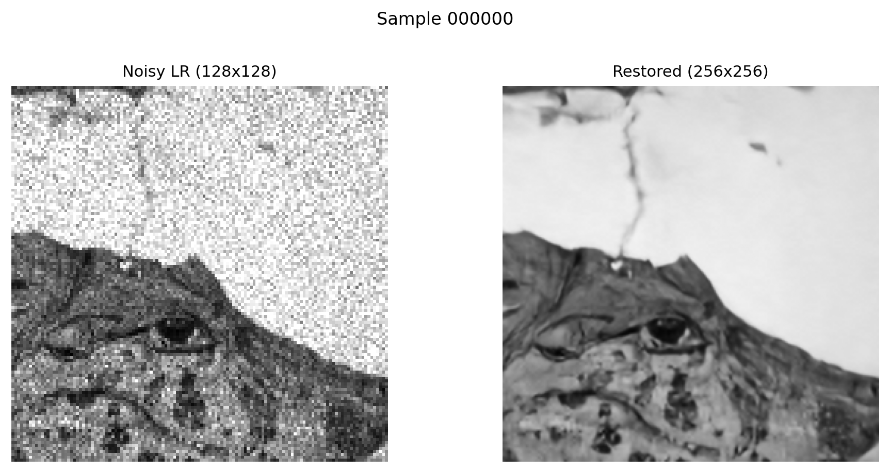
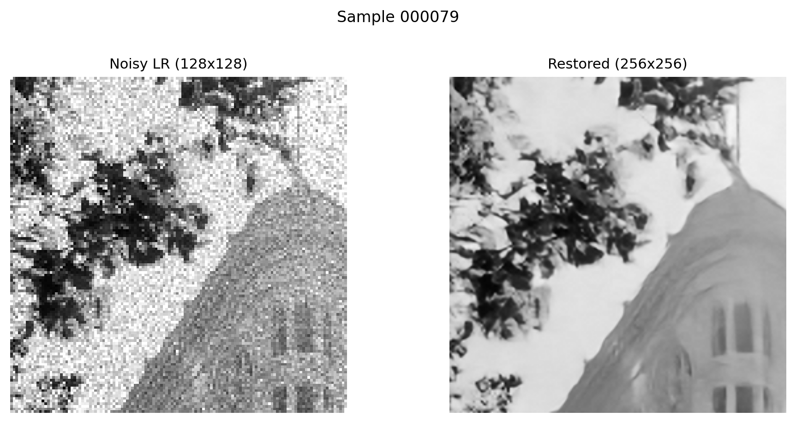
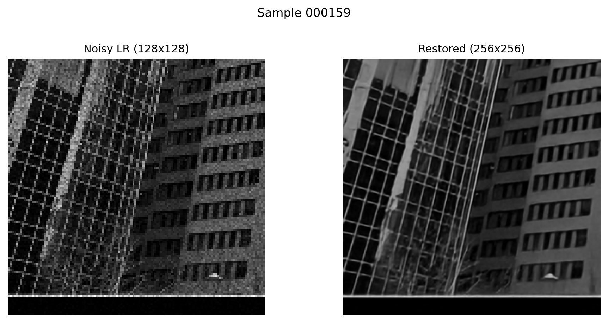
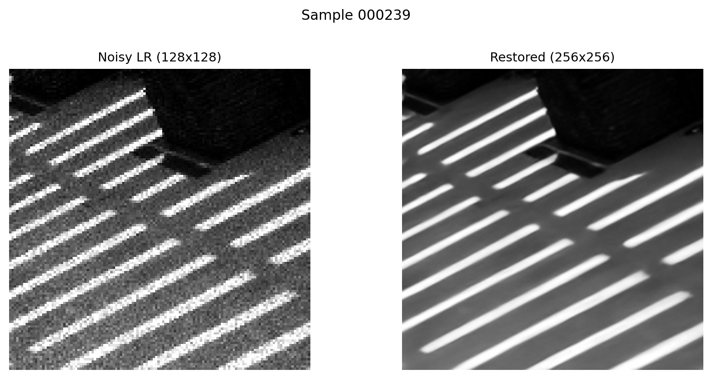
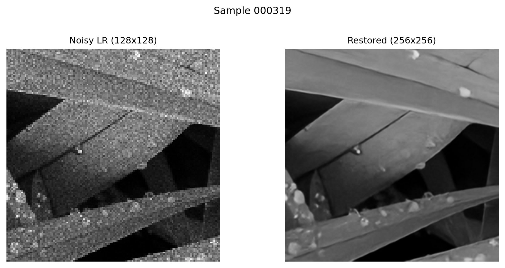
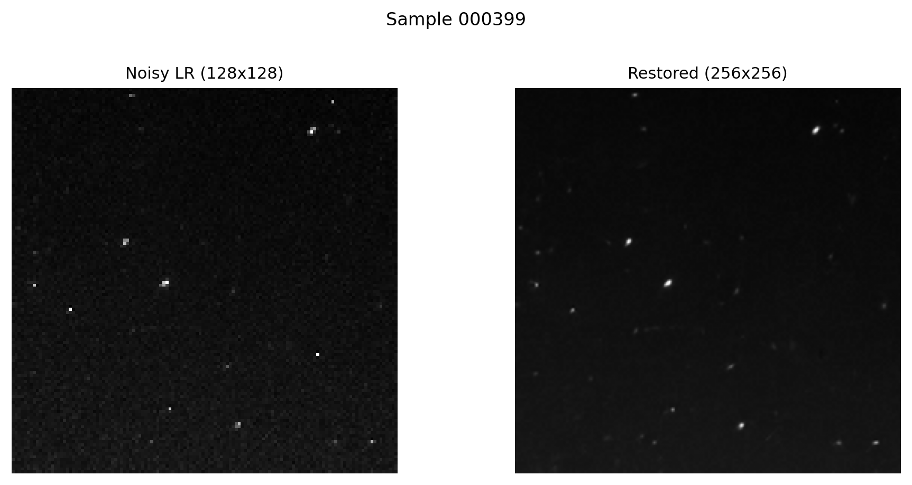
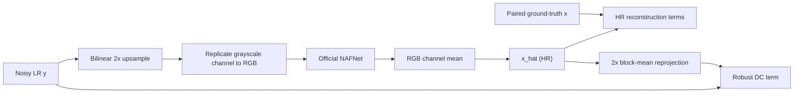

# Physically Motivated Compound-Degradation Image Restoration

> [2nd Place Overall, Team TAUIG](https://drive.google.com/file/d/1J8r_s9TB1i0g8wlXXWLe6oYmtwyoM9_I/view?usp=sharing), KLA AI Hackathon, IIT Hyderabad 2026.
> [Public leaderboard](https://drive.google.com/file/d/1ljUQov6SCQWBecOtH92l9pNomgWWjmEg/view?usp=sharing): rank 13 (0.88614). [Private leaderboard](https://drive.google.com/file/d/1yg0PYCcsbPbGYoGU24Yfj9zb5nMNqvGM/view?usp=sharing): rank 10 (0.88303). [Final presentation rank](https://www.linkedin.com/feed/update/urn:li:activity:7462877666421923840/): rank 2.

This is a grayscale, 2x joint super-resolution and restoration pipeline for paired `.npy` data. It starts with an official SIDD-pretrained NAFNet, adapts that RGB restoration backbone to a one-channel low-resolution observation, and fine-tunes it with paired high-resolution supervision plus a robust, signal-dependent low-resolution reprojection constraint.

The aim of this README is to state precisely what the code does. In particular, the heteroscedastic term is a fixed-calibration consistency regularizer, not an uncertainty-prediction head and not an unqualified claim of a new noise model.


## Qualitative outputs

The following six panels are generated test outputs and are versioned in [`outputs/presentation_qualitative_png/`](outputs/presentation_qualitative_png/). Each compares a noisy `128 x 128` low-resolution observation with the pipeline's `256 x 256` restoration. They are qualitative evidence only: no test ground truth is used in these panels, so they should not be read as a PSNR or SSIM measurement.

| Sample 000000 | Sample 000079 |
| --- | --- |
|  |  |
| Sample 000159 | Sample 000239 |
|  |  |
| Sample 000319 | Sample 000399 |
|  |  |

## Pipeline in one view



Let `x` be the clean high-resolution image, `y` its noisy low-resolution observation, and `x_hat = f_theta(y)` the prediction. The implementation uses `x, x_hat in [0, 1]^(H x W)` and `y in R^((H/2) x (W/2))` for the default scale `s = 2`.

At training time, filename intersection pairs `data/train/GT/<name>.npy` with `data/train/NoisyLR/<name>.npy`. Arrays may be `H x W`, `C x H x W`, or `H x W x C`; they are canonicalized to `C x H x W`. Each pair is spatially aligned, then a matching crop is sampled from both resolutions. The crop is an integer multiple of `s * 8`, which keeps the LR crop compatible with NAFNet's four encoder downsampling stages. Validation uses the deterministic 10% filename split and no augmentation.

## Model: adapting NAFNet to grayscale 2x restoration

The trainable model is implemented in [`src/model.py`](src/model.py). The wrapper does not alter the official NAFNet topology. For a one-channel LR input it computes

```math
\hat{x} = \mathrm{clip}_{[0,1]}\left[
\frac{1}{3}\sum_{c=1}^{3}
\mathcal{B}_{\theta}\left(\mathrm{rep}_3\left(U_2(y)\right)\right)_c
\right],
```

where `U_2` is bilinear interpolation with `align_corners=False`, `rep_3` repeats the grayscale channel three times, and `B_theta` is the official RGB NAFNet backbone. The wrapper crops its output to exactly `2H x 2W` and clamps it to the valid intensity range. Repeating and averaging are deliberate compatibility adapters: they let an RGB SIDD checkpoint initialize a grayscale model while the full backbone is still fine-tuned on the target task.

The default `sidd-width64` backbone has encoder block counts `(2, 2, 4, 8)`, 12 bottleneck blocks, and decoder counts `(2, 2, 2, 2)`. Its widths double through four encoder levels. A NAFBlock uses LayerNorm, pointwise expansion, depthwise `3 x 3` convolution, a channel split/multiply `SimpleGate`, simplified channel attention, and residual scalars `beta` and `gamma` initialized to zero. The official backbone also has a global residual connection from its RGB input to output. This is why NAFNet is useful here: it provides a strong restoration prior without the overhead of attention-heavy or activation-heavy blocks, while still preserving local detail through U-Net skips and residual paths.

The checkpoint loader accepts common NAFNet checkpoint keys (`params_ema`, `params`, `model`, or a root state dict), strips `module.` and `backbone.` prefixes, and loads into the official backbone. `strict_pretrained: false` is intentional for diagnostics and partial compatibility reporting; inference checkpoints produced by this repository load strictly.

## Observation model and why it is heteroscedastic

The low-resolution consistency branch assumes a 2x block-mean forward operator. With `D_s` denoting average pooling over non-overlapping `s x s` blocks, the code evaluates

```math
\mu = D_s(\hat{x}), \qquad
q = \frac{D_s(\hat{x} \odot \hat{x})}{s^2}, \qquad
v = \max(b + a q, 10^{-8}).
```

For the provided configuration, `s = 2`, `a = 0.14160734`, and `b = 0.000063383`. The additional division by `s^2` in `q` is part of the implemented H2 calibration; `q` should therefore be read as the code's scaled local energy statistic, not casually relabeled as an ordinary second moment.

`v` changes from pixel to pixel because it depends on the predicted local signal energy. That is heteroscedasticity: the conditional noise scale is not a single constant shared by every pixel. It is needed here because the target degradation combines a signal-dependent component (consistent with speckle-like behavior) with an intensity-independent floor (the `b` term, consistent with read/AWGN-like residual noise) before or alongside block averaging. A homoscedastic reprojection loss would insist equally strongly on matching a dark, smooth region and a bright or high-energy region even though their noise behavior differs.

This is a practical calibration model, not a claim that the exact sensor likelihood has been recovered. `a` and `b` are fixed hyperparameters in the supplied config. The training loop can optionally apply multiplicative jitter to them, but the default config sets `h2_jitter: 0.0`.

For reference, the repository contains the full Student-t negative log likelihood

```math
-\log p(y_i \mid \mu_i, v_i) = C(\nu) + \frac{1}{2}\log v_i
+ \frac{\nu + 1}{2}\log\left(1 + \frac{(y_i-\mu_i)^2}{\nu v_i}\right),
```

in `student_t_nll`. The active training objective deliberately uses the safer robust form below instead:

```math
\mathcal{L}_{\mathrm{DC}} = \frac{1}{N}\sum_i
\log\left(1 + \frac{(y_i - \mu_i)^2}
{\nu\,\mathrm{stopgrad}(\max(v_i,10^{-4}))}\right).
```

The supplied training config uses `nu = 3`. This distinction matters. The active term omits the `log(v)` likelihood term and detaches the variance weights. Consequently, gradients cannot improve the loss by manipulating the predicted variance through `q`; `v` only supplies a locally adaptive, heavy-tailed residual weight. This is the explicit safeguard against variance-collapse or variance-inflation shortcuts mentioned in [`src/losses.py`](src/losses.py). The data-consistency term is then a regularizer on an already supervised HR restoration model, rather than the sole source of learning signal.

## Training objective

The generic objective implemented in [`src/losses.py`](src/losses.py) is

```math
\begin{aligned}
\mathcal{L} ={}& \lambda_P\mathcal{L}_{\mathrm{PSNR}}
+ \lambda_1\mathcal{L}_1
+ \lambda_2\mathcal{L}_2
+ \lambda_C\mathcal{L}_{\mathrm{Charb}}
+ \lambda_F\mathcal{L}_{\mathrm{FFT}} \\
&+ \lambda_D\mathcal{L}_{\mathrm{DC}}
+ \lambda_S(1-\mathrm{SSIM})
+ \lambda_L\mathcal{L}_{\mathrm{LPIPS}}
+ \lambda_E\mathcal{L}_{\mathrm{edge}}.
\end{aligned}
```

The terms are concrete code paths, not all mandatory objectives:

- `L_PSNR = (10 / ln 10) mean(log(MSE + 1e-8))`. Minimizing it is equivalent to maximizing PSNR.
- `L_Charb = mean(sqrt((x_hat - x)^2 + epsilon^2))` is a smooth robust pixel penalty.
- `L_FFT` is L1 distance between log magnitudes of orthonormal 2D real FFTs. It is introduced late to preserve relative frequency content without letting bright frequencies dominate.
- `1 - SSIM` measures structural mismatch on clamped `[0,1]` images. The code requires `pytorch-msssim` when this nonzero term is requested.
- LPIPS replicates grayscale to RGB and maps it to `[-1,1]` before the frozen LPIPS network. Edge loss is L1 difference of horizontal and vertical finite differences.

The checked-in `roi_psnr_120e` preset is not a static collection of the YAML weights: [`train_nafnet_ddp.py`](train_nafnet_ddp.py) overrides them with a three-stage schedule. The following are anchor values for the default 120-epoch run; intermediate values are linearly interpolated.

| Epoch anchor | PSNR | L1 | L2 | Charbonnier | FFT | DC | SSIM |
| --- | ---: | ---: | ---: | ---: | ---: | ---: | ---: |
| 0 to 19 | 1.0 | 0.050 | 0.010 | 0.010 | 0.000 | 0.000 | 0.000 |
| 20 | 1.0 | 0.050 | 0.010 | 0.010 | 0.000 | 0.000 | 0.000 |
| 90 | 1.0 | 0.030 | 0.005 | 0.008 | 0.010 | 0.010 | 0.015 |
| final | 1.0 | 0.020 | 0.000 | 0.005 | 0.015 | 0.008 | 0.020 |

LPIPS and edge loss are available but disabled by the default config (`lambda_lpips_max: 0.0`, `lambda_edge: 0.0`). The early stage first learns accurate HR reconstruction; the later stages add frequency, reprojection, and structural constraints only after the base mapping is stable. The optional adaptive DC scheduler increases or decreases its weight according to validation PSNR, but the checked-in config uses the stated stage weights instead.

## Robustness curriculum

Paired geometric augmentation always preserves the LR-to-HR correspondence: independent horizontal flips, vertical flips, and rotations by multiples of 90 degrees are applied to both images. The out-of-distribution augmentation is intentionally input-only. With a configured probability, it composes a random subset of affine gain/bias, gamma, Gaussian noise, multiplicative speckle, Poisson noise, reflected `3 x 3` blur, stripe noise, impulse noise, and cutout corruption on the LR observation. The GT target remains clean.

For the default `max` profile, the 120-epoch curriculum is:

- Epochs 0 to 19: `strong` profile, OOD probability capped at 0.70, at most 3 synthetic operators.
- Epochs 20 to 89: `max` profile, OOD probability 0.95, at most 5 operators.
- Epochs 90 onward: `strong` profile, with probability decaying from 0.80 toward 0.50 and the operator count from 3 toward 2.

This gives the model exposure to mismatches that a hidden test distribution may contain without replacing the paired objective. The code supports progressive freezing of the NAFNet introduction and early encoder stages, but `staged_freeze: false` in the provided config, so the default run fine-tunes all backbone parameters throughout. That detail is easy to miss and is important for reproducing the actual experiment.

Optimization uses AdamW with `beta=(0.9, 0.9)`, base learning rate `5e-4`, zero weight decay, a three-epoch linear warm-up from 5% of the base learning rate, and cosine annealing to `1e-7`. The provided config disables AMP for training. Distributed runs use `DistributedSampler`; ranks receive seed `42 + rank`; metrics are reduced before validation checkpoint selection. `best.pt` is selected by validation PSNR, with compact `best_infer.pt` exports for inference.

## Inference and submission

Inference selects checkpoints in this order when `checkpoint: auto`: `best_lpips_infer.pt`, `best_infer.pt`, `best_lpips.pt`, `best.pt`, `latest_infer.pt`, then `latest.pt`. It validates each exported prediction as finite, one-channel, and `256 x 256` before writing it.

Test-time augmentation averages predictions after applying and inverting spatial transforms:

- `fast`: no TTA and no refinement.
- `balanced`: four flip variants and 3 refinement steps at `8e-4`.
- `high`: eight flip/transpose variants and 8 refinement steps at `5e-4`.

Refinement is deliberately local: it initializes `x_opt` from the NAFNet prediction and runs Adam directly on the HR pixels to minimize `L_DC(y, D_2(x_opt))`, clamping after every step. It has no extra image prior of its own; the pretrained/fine-tuned NAFNet output is the prior. This is why only a small number of steps is used.

The submission writer sorts `.npy` prediction filenames, checks the expected shape and finite values, serializes each with `numpy.save`, base64-encodes the bytes, and writes one-indexed `id,npy_base64` rows. This preserves exact array serialization rather than flattening pixel values into CSV text.

## Reproduce

Install the runtime dependencies, the official NAFNet implementation, and the SIDD width-64 checkpoint:

```bash
python3 -m venv .venv
source .venv/bin/activate
pip install -r requirements.txt
bash scripts/setup_nafnet_official.sh
bash scripts/download_nafnet_sidd_width64.sh
```

Expected paired training layout:

```text
data/train/
├── GT/
│   └── 000000.npy
└── NoisyLR/
    └── 000000.npy
```

Run the default distributed configuration:

```bash
torchrun --nproc_per_node=4 train_nafnet_ddp.py --config configs/train_nafnet_h2.yaml
```

Run the local balanced inference configuration:

```bash
python3 infer_nafnet_ddp.py --config configs/infer_nafnet_h2.yaml --checkpoint checkpoints/nafnet_h2/best_infer.pt
```

Create a Kaggle-style submission from prediction files:

```bash
python3 make_submission_csv.py --submission-dir outputs/nafnet_h2/test_predictions --output-csv submission.csv
```

The Kaggle wrapper uses [`configs/kaggle_infer_nafnet_best_infer.yaml`](configs/kaggle_infer_nafnet_best_infer.yaml):

```bash
python3 infer_nafnet_kaggle_best_infer.py
```

## Repository map and artifact policy

- `src/`: paired-data loading, NAFNet adapter, losses, configuration, and DDP helpers.
- `train_nafnet_ddp.py`: training, curriculum, scheduling, validation, and checkpointing.
- `infer_nafnet_ddp.py`: TTA, optional DC refinement, validation, and submission writing.
- `configs/`: reproducible train, local inference, and Kaggle presets.
- `scripts/`: setup, official-checkpoint inspection, `.npy` pair preparation, and qualitative figure helpers.
- `notebooks/`: Kaggle-oriented exploration and submission template.
- `outputs/presentation_qualitative_png/`: the six small, versioned presentation panels above.

Datasets, checkpoints, raw prediction arrays, CSV submissions, the cloned official NAFNet checkout, and downloaded NAFNet weights remain ignored. Only the six PNG panels are exempted from the `outputs/` rule because they are lightweight, human-inspectable evidence of what the pipeline produces.

## Team

Team TAUIG, Department of Artificial Intelligence, Indian Institute of Technology Hyderabad:

- Supriyo Banerjea (AI24MTECH12005)
- Debanjan Das (AI24MTECH12009)
- Sumanta Manna (AI24MTECH12011)

## References

- Chen, L. et al. "Simple Baselines for Image Restoration (NAFNet)." ECCV, 2022.
- The vendored setup script retrieves the official [Megvii NAFNet implementation](https://github.com/megvii-research/NAFNet).
